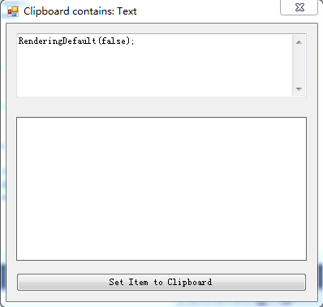
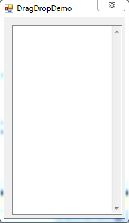

# ClipboardDemo
* **界面**  

* **功能**  
自动捕捉剪切板变化，并显示其中的文字、图片、文件以及自定义类型。                

# DragDropDemo
* **界面**  

* **功能**
实现文件的拖拽以及两应用程序之间的拖拽。                     

# Serialize_Deserialize          
* **功能**                  
实现了.NET支持的三种序列化方式：                
1. 二进制序列化                                
2. SOAP序列化                              
3. XML序列化                        

# Serialize_Extra          
* **功能**                  
为三种序列化提供了一个比较完善的框架，并进行了对比：                
1. 二进制序列化                                
2. Json序列化                              
3. XML序列化     
* **配置要求**    
VSCode + .Net Core + NewtonSoft.Json      

# [IClonableDemo](https://github.com/xiong-ang/CShape_SLN/tree/master/ICloneableDemo)          
* **功能**                  
实现了四种类型的Clone： 
1. 基本类型
2. 对象类型
3. List
4. Dictionary                    